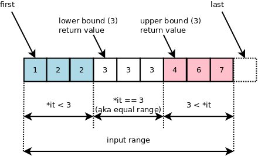

> Binary Search와 Binary Search의 변형인 upper bound, lower bound에 대해 공부한다.

### Binary Search

주어진 자료에서 중복되지 않은 값이 주어질 때, 그 데이터 내에 특정 값이 존재하는지 검색하는 알고리즘 중 하나. 검색 속도는 O(logn)으로 굉장히 빠르다. 하지만, 전제가 있는데 주어진 자료가 정렬된 상태여야 한다.

### Binary Search code

    private static <T> int indexedBinarySearch(List<? extends Comparable<? super T>> list, T key) {
        int low = 0;
        int high = list.size()-1;

        while (low <= high) {
            int mid = (low + high) >>> 1;
            Comparable<? super T> midVal = list.get(mid);
            int cmp = midVal.compareTo(key);

            if (cmp < 0)
                low = mid + 1;
            else if (cmp > 0)
                high = mid - 1;
            else
                return mid; // key found
        }
        return -(low + 1);  // key not found
    }

java.util.Collections에서 제공하는 코드이다.

특정 값이 존재하면 특정 값의 위치를 반환하고, 특정 값이 존재하지 않으면 음수를 반환한다.

### Upper bound, lower bound?

만약 주어진 자료에 중복이 존재한다면 Binary Search의 반환값에 일관성이 없을 것이다. Binary Search를 약간 변형한 알고리즘이다. 해당 알고리즘 또한 주어진 자료가 정렬된 상태여야 한다.

그림 출처 : [http://bajamircea.github.io/coding/cpp/2018/08/09/lower-bound.html](http://bajamircea.github.io/coding/cpp/2018/08/09/lower-bound.html)

위 그림을 보자,  
binarySearch와 마찬가지로 찾고자 하는 key 값이 필요하다. binarySearch와 다르게 중복되는 값이 여러개 존재 할 수 있다.  
중복되는 값 중 가장 낮은 위치의 값이 lower bound,  
중복되는 값 중 가장 높은 위치 + 1의 값이 upper bound이다.

### Lower bound code

      public static int lowerBound(int[] array,  int value) {
        int low = 0;
        int high = array.length;
        while (low < high) {
            final int mid = low + (high - low)/2;
            if (value <= array[mid]) {
                high = mid;
            } else {
                low = mid + 1;
            }
        }
        return low;
    }

### Upper bound code

      public static int upperBound(int[] array, int value) {
        int low = 0;
        int high = array.length;
        while (low < high) {
            final int mid = low + (high - low)/2;
            if (value >= array[mid]) {
                low = mid + 1;
            } else {
                high = mid;
            }
        }
        return low;
    }

해당 코드들의 출처 : [https://jackpot53.tistory.com/33](https://jackpot53.tistory.com/33)
