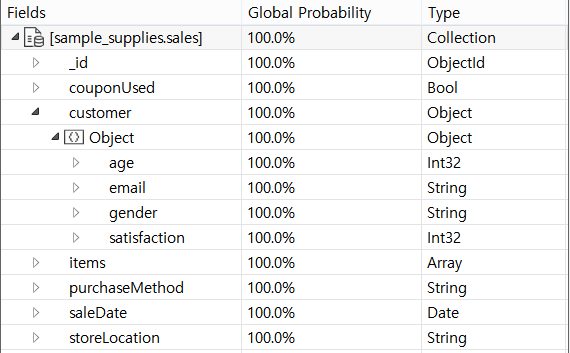

DB에서 조회 성능을 향상시키기 위해 인덱스를 많이 사용한다.  
단순히 인덱스를 생성하는 것만으로는 조회의 성능을 향상시켜 주지 않는다.  
오늘은 인덱스를 활용하는 방법 중 하나인 Covered Query(혹은 Real MongoDB에서는 Covering Index)를 정리해보려 한다.

## Covered Query

Database에서 인덱스를 생성할 때 테이블(혹은 MongoDB에서는 컬렉션)을 구성하고 있는 컬럼을 지정하게 된다.  
인덱스는 일반적으로 B-tree의 구조로 생성되며, B-tree를 구성하는 노드에는 인덱스를 생성할 때 지정했던 컬럼들의 값이 포함되어 있다.  
이러한 구조 덕분에 인덱스를 구성하고 있는 컬럼만으로 쿼리를 처리할 수 있다면 실제 데이터 파일에 접근하지 않고도 쿼리를 처리할 수 있게되며, 이러한 방식을 Covered Query라고 한다.  
이 방식은 실제 데이터에 접근하지 않고 B-tree 노드에 있는 값으로만 처리하기 때문에 실제 데이터에 접근하기 위한 Disk I/O의 횟수를 줄일 수 있어 빠른 조회가 가능해진다.

## Covered Query 조건

[MongoDB Covered Query Docs](https://www.mongodb.com/docs/manual/core/query-optimization/#covered-query)에서는 아래의 조건을 만족할 때 인덱스만 사용해서 쿼리를 처리할 수 있다고 한다.

- query에서 사용되는 필드가 인덱스의 일부(인덱스를 구성하고 있는 필드)일 때
- 쿼리의 결과로 반환되는 모든 필드가 같은 인덱스 안에 있을 때
- null 일치 연산자를 사용하지 않는 쿼리

## 예시

MongoDB에서 제공하는 샘플 데이터를 사용하였다.(sample_supplies Database의 sales 컬렉션)
컬렉션의 스키마는 아래 사진과 같다.


위 컬렉션에서 2017년 7월부터 현재까지 방문 했던 고객의 age를 조회하려고 한다.

```
db.sales.find({ saleDate: {$gte: new Date('2017-07-01') } }, { "customer.age": 1 });
```

아무런 인덱스를 생성하지 않고 위의 쿼리를 실행하면 COLLSCAN(전체탐색)을 하게 된다.

이제 인덱스를 생성하고 동일한 쿼리를 실행시켜 보자.

```
db.sales.createIndex({ saleDate: 1, customer: 1 });

db.sales.find({ saleDate: {$gte: new Date('2017-07-01') } }, { _id: 0, "customer.age": 1 });
```

\_id를 명시적으로 projection 하지 않겠다고 한 이유는 MongoDB가 기본적으로 \_id를 항상 projection 하기 때문이다.  
이제 COLLSCAN stage가 제거되고, IXSCAN(인덱스 탐색)을 하게 된다.  
하지만, 예상과 다르게 FETCH(실제 데이터를 가져오는 과정)는 제거되지 않았다.  
customer는 Object 타입인데 Object 타입으로 인덱스를 생성해서 발생하는 문제로 보인다.

그래서 인덱스 생성을 조금만 달리 해보았다.

```
db.sales.createIndex({ saleDate: 1, "customer.age": 1 });

db.sales.find({ saleDate: {$gte: new Date('2017-07-01') } }, { _id: 0, "customer.age": 1 });
```

이제야 FETCH 과정이 제거되고, IXSCAN, PROJECTION_DEFAULT 과정만 남게 되었다.

이렇게 쿼리를 처리할 때 사용하는 필드들이 모두 인덱스에 포함되어 있는 필드라면 FETCH 과정을 생략할 수 있어서 조회 속도를 높일 수 있다.
