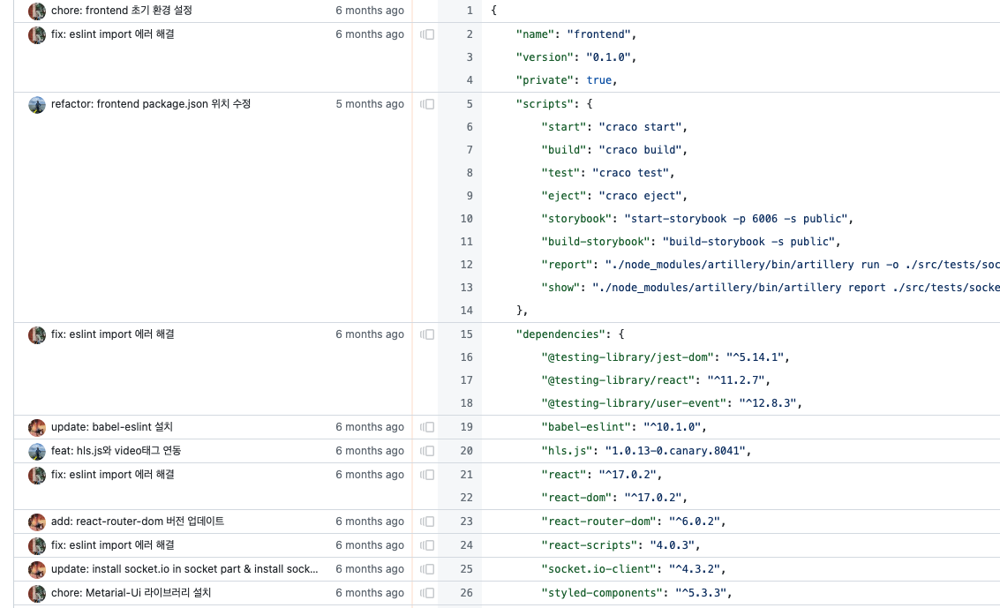
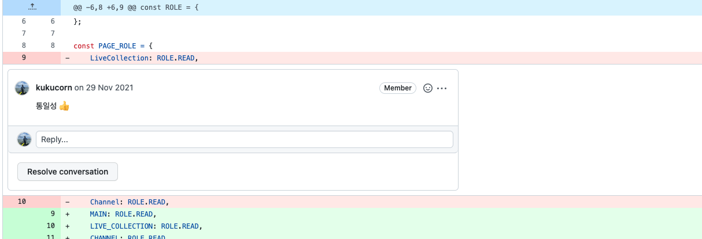
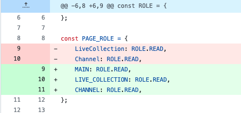
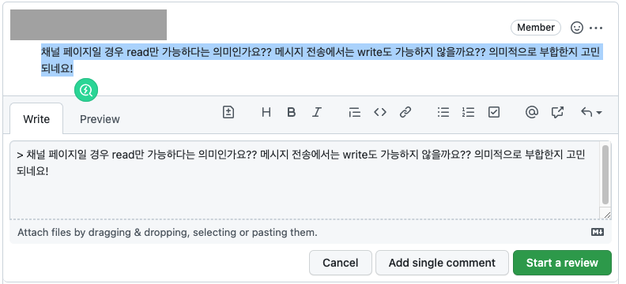

> Github의 다양한 단축키 중 유용하다고 생각되는 단축키를 정리한다.

더 많은 단축키는 [공식문서](https://docs.github.com/en/get-started/using-github/keyboard-shortcuts)를 참고해주세요~

### S or /

검색창으로 커서를 포커스한다.

### T

Repository에서 파일을 검색한다.

### B

Blame view를 보여준다.  
이를 통해 소스코드의 특정부분을 누가 언제 수정했는지 알 수 있다.

### I

PullRequest에서 수정된 소스코드를 확인할 때, 코멘트를 숨기거나 보이게 할 수 있다.  

  

이 상태에서 I를 누르면, 코멘트가 사라진다.  

  

### R

코멘트의 답변으로 이전 코멘트를 쉽게 인용할 수 있다.  
인용할 코멘트를 선택하고 R을 누르기!

  