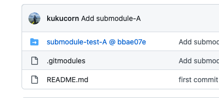

> git submodule에 대한 포스팅입니다.

## 소개

A라는 프로젝트에서 B라는 프로젝트를 사용해야 할 때, 가장 쉬운 방법은 B 프로젝트의 코드를 A 프로젝트의 폴더로 복사하는 방법일 것이다. 하지만, 만약에 여러 프로젝트에서 동일한 프로젝트를 필요로 한다면 어떻게 될까? 필요로 하는 프로젝트에 모두 복사하는 방법이 있을 것이다. 하지만, 이 방법은 비효율적이고 관리하기 어렵다는 단점이 있다. 왜냐하면 공통으로 사용하고 있는 프로젝트를 수정해야 한다면 수정된 내용이 사용 중인 모든 프로젝트에 적용이 되어야 하기 때문이다. 이럴 때 git 에서 제공하는 submodule을 사용해서 소스코드를 쉽게 관리할 수 있다.  
  
## 설명

submodule을 사용하면 .gitmodules라는 폴더가 루트 경로에 생기게 된다.  
  
.gitmodules에는 현재 프로젝트에서 사용 중인 submodule에 대한 정보가 들어있다.  
  
```tsx
// .gitmodules
[submodule "submodule-test-A"]
        path = submodule-test-A
        url = https://github.com/kukucorn/submodule-test-A
```
  
submodule마다 path(어느 폴더에 submodule의 소스코드가 들어있는지), url(submodule의 깃헙 레포의 주소)을 가지고 있다.  
  
이 파일은 깃헙 레포를 통해서 다른 사람과 공유되고, 다른 사람이 레포를 clone했을 때, submodule은 빈 폴더로 존재하게 되는데, .gitmodules에 명시된 정보를 통해서 빈 폴더를 submodule의 소스코드로 채울 수 있게 된다.  

github repo에서 submodule의 형태가 특이하다.  
  
위 캡쳐 사진을 보면 기본 폴더의 모양이 아닌 것을 알 수 있다.  
오른쪽에 bbae07e는 submodule repo의 특정 commit을 가리키는 해시 값이다.  


## 사용법

```tsx
// git clone으로 parent repository만 가져온 상태이고, 
// submodule의 정보가 명시된 .gitmodules파일은 존재하는데 submodule의 폴더가 비어있는 상태라면
$ git submodule update --init

or

// git clone을 하면서 submodule의 폴더를 채우려면 --recursive 옵션을 사용하면 된다.
$ git clone --recursive <URL to main repo>
```

혹은 다른 프로젝트를 서브모듈로 추가하고 싶다면,  

```tsx
$ git submodule add <URL to submodule repo>
```

혹은 서브모듈의 변경점을 적용하고 싶다면(서브모듈 레포에 새로운 커밋이 생성되었다면)  

```tsx
$ git submodule update --remote
```

마지막으로, 사용하지 않는 submodule을 삭제하고 싶다면  